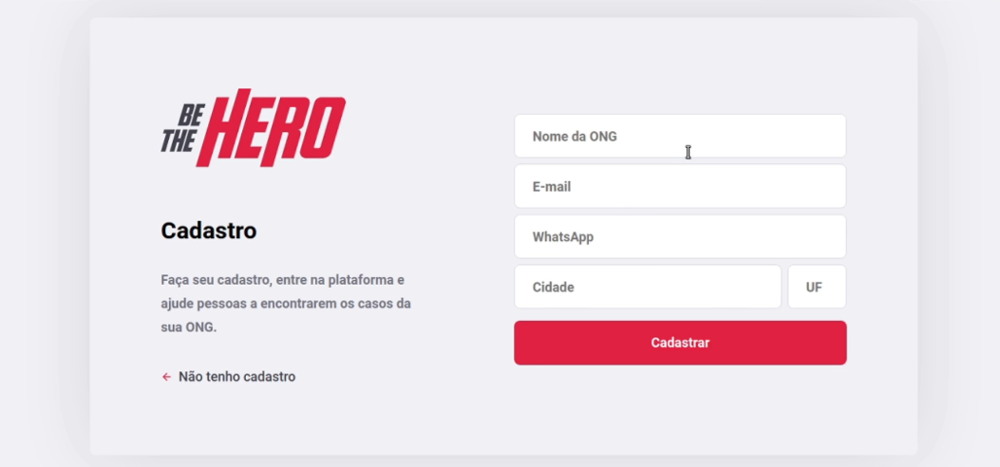
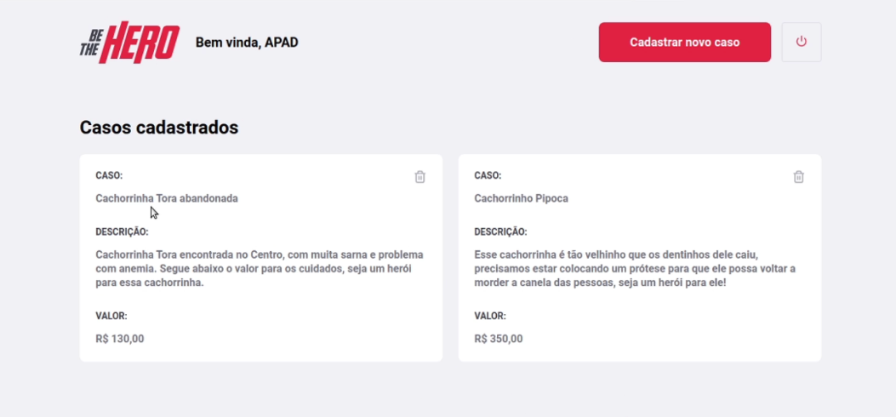
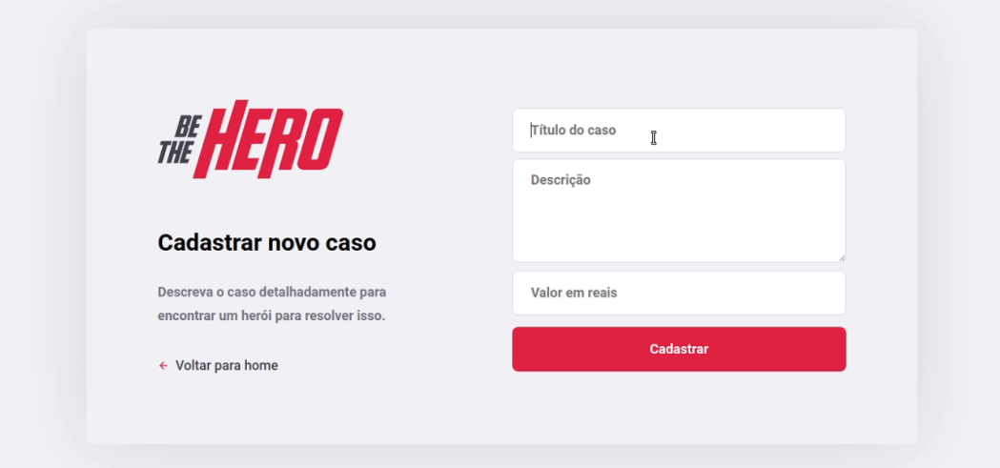
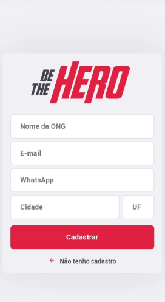
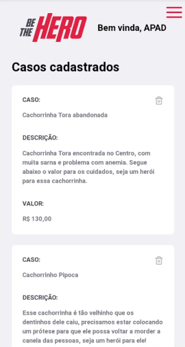
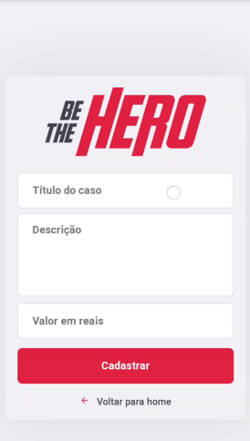

# Semana OmniStack 11 - Web

### Rodando o projeto local

- `yarn install`

- `yarn start`

### Buildando o projeto

- `yarn build`

### Imagens da aplicação

### Imagens da aplicação responsiva

